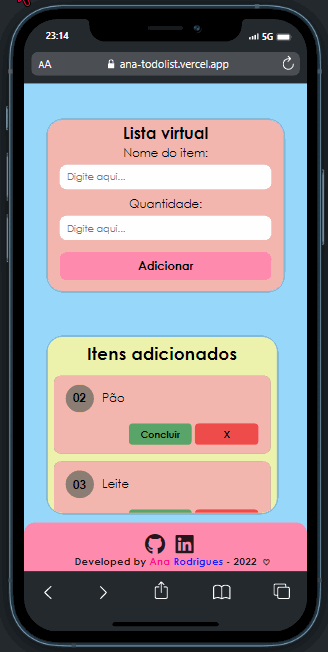

# 🖊 toDo List

Esse foi um dos projetos onde mais apliquei meu conhecimento em JavaScript. ✨  

### 📌  Você pode acessar o projeto clicando <a href= "https://ana-todolist.vercel.app/"> AQUI </a>  
#### - ou dar uma olhadinha nos gifs do projeto, ao final do readme. <3

## ​👩‍💻​ Desenvolvimento

Para desenvolver o projeto, foram utilizadas apenas as tecnologias HTML, CSS e JavaScript. A biblioteca FontAwesome também fooi manuseada durante o desenvolvimento. Foram aplicados conhecimentos responsividade e DOM do Javascript, usufruindo do recurso Media Query.  
Somente a estrutura principal do site foi feita a mão com HTML, o restante é criado a partir do DOM.

## 💡 Aprendizados

O projeto foi inspirado em um projeto dos cursos realizados na Alura, <a href="https://github.com/alura-cursos/js_localStorage/tree/aula_5"> este </a> é o código fonte dele.   
O site tem uma importância grande para o meu desenvolvimento, visto que foi o projeto onde o foco principal foi dado na linguagem de programação JavaScript. 👩‍💻

## 💢 Demonstração
#### - Tela inicial
 
#### - GIF da página
 

#### - Responsividade (Iphone 12 PRO) 

##### Você pode conferir meus outros projetos clicando <a href= "https://anaprojetos.vercel.app/"> AQUI</a>.
#### ⚡ Estou aberta a opiniões construtivas, dicas e idéias.
## - Obrigada por ler até aqui! 💗
